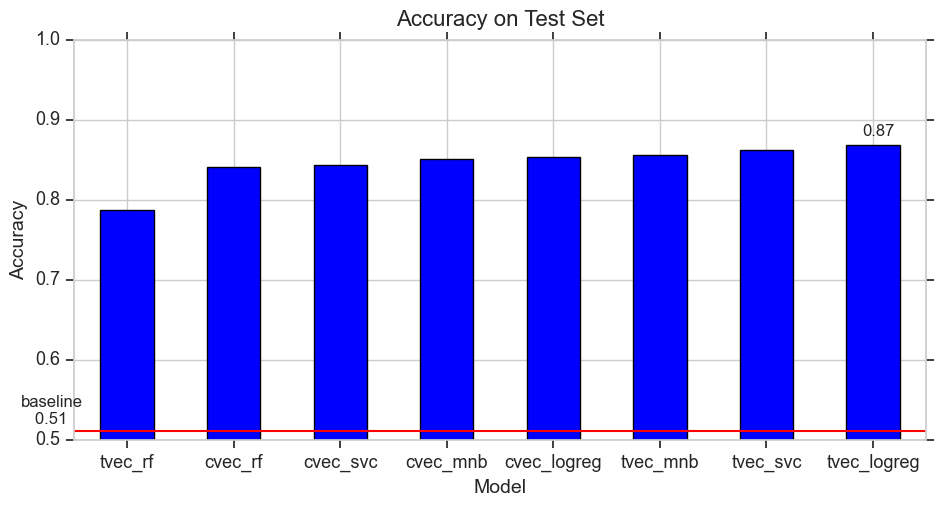
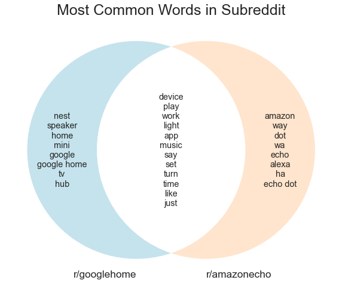
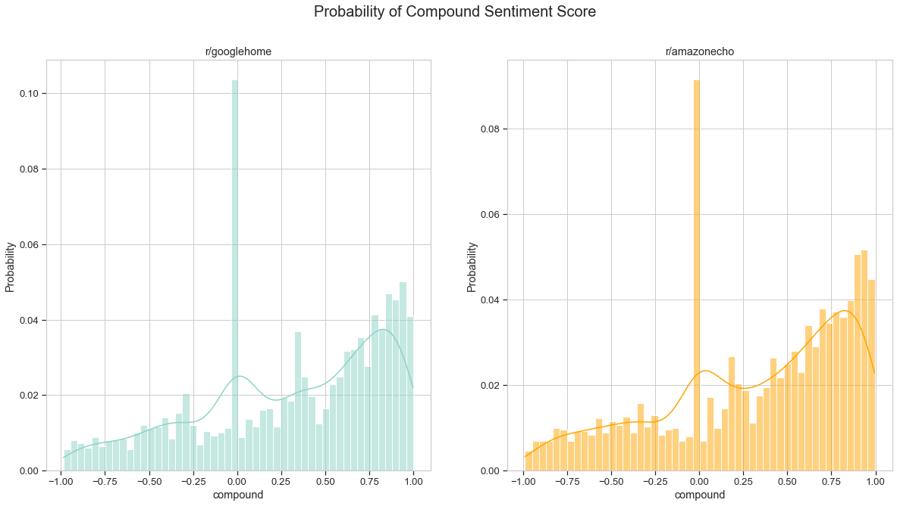
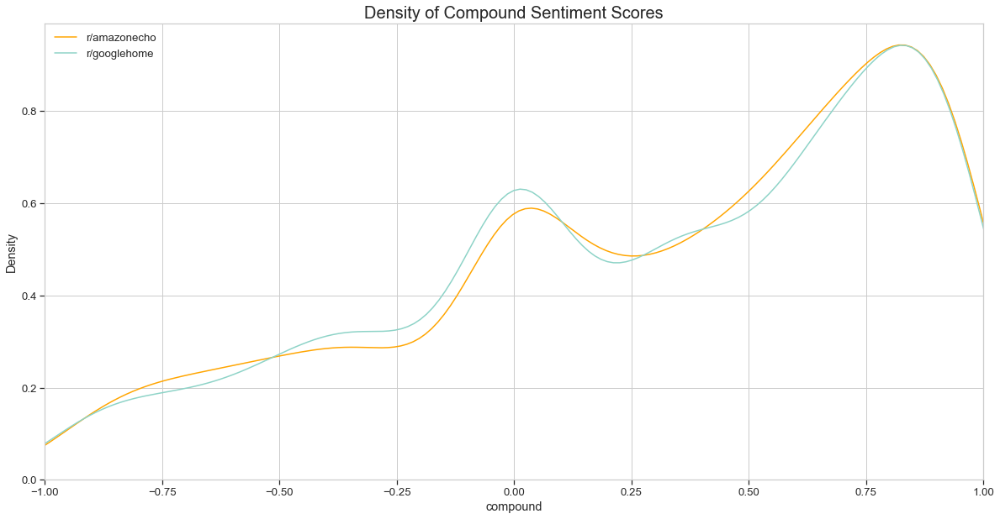

## Project 3 - Sentiment Analysis of Smart Speaker Subreddits
---

## Executive Summary 

The goal of this study is to conduct a sentiment analysis of using post data from two subreddits, r/googlehome and r/amazonecho, to derive insight to improve Google Home's product strategy.

General sentiment on each subreddit was examined using the VADER Sentiment Analyzer in NLTK. As the VADER Sentiment Analyzer model applies to general text, several classification models were constructed to more closely model the domain-specific lexicon used in these subreddits. Feature importances were extracted from the best performing model to determine if specific sentiments were more prevalent in r/googlehome or r/amazonecho.

The findings showed that sentiment across both subreddits was rather similar, with slightly more positive sentiment on r/amazonecho, and more negative sentiment on r/googlehome. This may be indicative of more technical issues with Google Home than with Amazon Echo. Hence, we recommend for Google to improve its after sales service and troubleshooting support for Google Home.

 

---

## Problem Statement

Google, as the primary stakeholder, has tasked the team to conduct a broad-based sentiment analysis using Reddit data of r/googlehome[[1]](#ref), the main subreddit for Google Home products. As a comparator, similar sentiment analysis will be done on r/amazonecho[[2]](#ref)., the main subreddit for Amazon Echo, Google's foremost competitor in the smart speaker market. The findings will be aggregated with sentiment analysis on other social media platforms done by other teams, in order to improve Google Home's product strategy and its offerings to its customers (secondary stakeholder).

 

## Cleaned Data and Data Dictionary
* [`ghome_clean.csv`](./datasets/ghome_clean.csv): Cleaned data from r/googlehome
* [`aecho_clean.csv`](./datasets/aecho_clean.csv): Cleaned data from r/amazonecho

The data contains 2498 and 2609 posts scraped from r/googlehome and r/amazonecho, with post dates from Oct 2020 to Apr 2021. 

Both datasets have the same features
|Feature|Type|Description|
|:-:|:-:|---|
|subreddit|object|The subreddit of the post| 
|author|object|The reddit username of the author of the post|
|title|object|The title of the post|
|selftext|object|The content of the post|
|created_utc|object|The UTC date and time of the post|
|score|integer|The reddit score of the post as measured by upvotes minus downvotes|
|post|object|A feature created from concatenating the title and selftext features, with a &#x7c; character as a separator |
|clean_post|object|A feature created from applying text cleaning and lemmatizing to the post feature|
|word_count|integer|A feature created by counting the number of words in the clean_post feature|

 

## Methodology

### Data Scraping and Cleaning

3000 posts were scraped from r/googlehome and r/amazonecho using Pushshift API[[3]](#ref). Each post (the title and content) was subsequently cleaned to remove duplicate posts, spam posts, special characters and links. The words were lemmatized using WordNetLemmatizer to allow analysis.

### Data Exploration (EDA)

Using CountVectorizer, the study looked at the top 20 most common words words in each subreddit. A sentiment analysis was then carried out using VADER to determine the mean compound sentiment of posts in each subreddit.

### Data Modeling

To carry out further sentiment analysis, the text data in posts was used to construct classification models to predict the subreddit from the text data. The feature importances could then be analysed to understand which words were more unique to a particular subreddit. Amazon Echo was used as the predictor class, with posts in r/amazonecho assigned a 1 and those in r/googlehome assigned a 0.

8 models were constructed using permutations of CountVectorizer and TFIDFVectorizer with Logistic Regression, Random Forest, Multinomial Naive Bayes and Support Vector Classifier(SVC). Of this, TFIDFVectorizer with Logistic Regression performed the best as measured by classification accuracy on the test set. The best model had a classification accuracy on the test set of 0.87.

The coefficients of positive valence words vis-a-vis negative valence words were examined to determine sentiment unique to each subreddit. Words with higher coefficients indicate that they are more unique to the r/amazonecho subreddit, while the words with lower coefficients indicate that they are more unique to the r/googlehome subreddit.

## Findings

* The most common words unique to each subreddit mainly involve brand names, while some words referring to smart speakers are shared between both subreddits. 

* Sentiment scores under VADER are largely similar between both subreddits, with a slightly more positive mean compound score of 0.309 for r/amazonecho vs 0.301 for r/googlehome.

* Sentiment analysis using the Logistic Regression model showed that positive words tended to have higher coefficients and thus were more likely to be used in r/amazonecho, while selected negative words were more likely to be used in r/googlehome. 

| Sentiment | Words      | Coefficients |
|-----------|------------|--------------|
|           | 'good'     | 0.24         |
|           | 'great'    | 0.55         |
| Positive  | 'best'     | 0.16         |
|           | 'happy'    | 0.11         |
|           | 'love'     | 0.51         |
|           |            |              |
|           | 'bad'       | -0.39        |
|           | 'terrible' | 0.09         |
| Negative  | 'horrible' | 0.08         |
|           | 'issue'    | -0.11        |
|           | 'problem   | 0.11         |

 

## Recommendations
General Reddit sentiment on Amazon Echo seems to be slightly more positive than that of Google Home. As Reddit is mainly used as a forum to troubleshoot issues, this may be indicative of more issues with Google Home than with Amazon Echo. Hence, we recommend for Google to improve its after sales service and troubleshooting support for Google Home, to improve public perception of the Google Home brand.

### Limitations
* The findings in the study were confined to general positive or negative sentiment, as aggregated across all posts. Topic clustering could be done - posts troubleshooting issues could be grouped into a cluster, with specific products within the r/googlehome universe as subclusters. Looking at most common words within each subcluster would then allow for more specific findings on individual products.
* Additional brand specific words (e.g. Alexa, Nest) could be added to the existing list of stopwords to prevent the model from classifying using these words. This will force the model to derive more insight from the remaining words and surface features which are not so obvious.
* While VADER is a popular and useful tool, its sentiment analysis is not foolproof. For example, it may not recognise grammatical mistakes, sarcasm or jargon specific to home assistant products.

 

## Repo Contents
Code Folder
* [`01_data_collection.ipynb`](./code/01_data_collection.ipynb): Scraping data from subreddits using Pushshift API
* [`02_data_cleaning.ipynb`](./code/02_data_cleaning): Cleaning and processing text data, EDA and sentiment analysis using VADER
* [`03_data_modelling.ipynb`](./code/03_data_modelling): Modelling classification of posts in subreddit and sentiment analysis using Logistic Regression model

Datasets Folder
* [`ghome.csv`](./datasets/ghome.csv): Raw scraped data from r/googlehome
* [`aecho.csv`](./datasets/aecho.csv): Raw scraped data from r/amazonecho
* [`ghome_clean.csv`](./datasets/ghome_clean.csv): Cleaned data from r/googlehome
* [`aecho_clean.csv`](./datasets/aecho_clean.csv): Cleaned data from r/amazonecho

Images Folder 

* Images used for presentation

Presentation Folder

* [`slides.pdf`](./presentation/slides.pdf): Slides used for presentation

 

## References

[1]: Reddit: r/googlehome. Retrieved Apr 22, 2021, from https://www.reddit.com/r/googlehome/

[2]: Reddit: r/amazonecho. Retrieved Apr 22, 2021, from https://www.reddit.com/r/amazonecho/

[3]: Baumgartner, Jason & Zannettou, Savvas & Keegan, Brian & Squire, Megan & Blackburn, Jeremy. (2020). The Pushshift Reddit Dataset.  Retrieved Apr 22, 2021, from https://arxiv.org/pdf/2001.08435.pdf.

